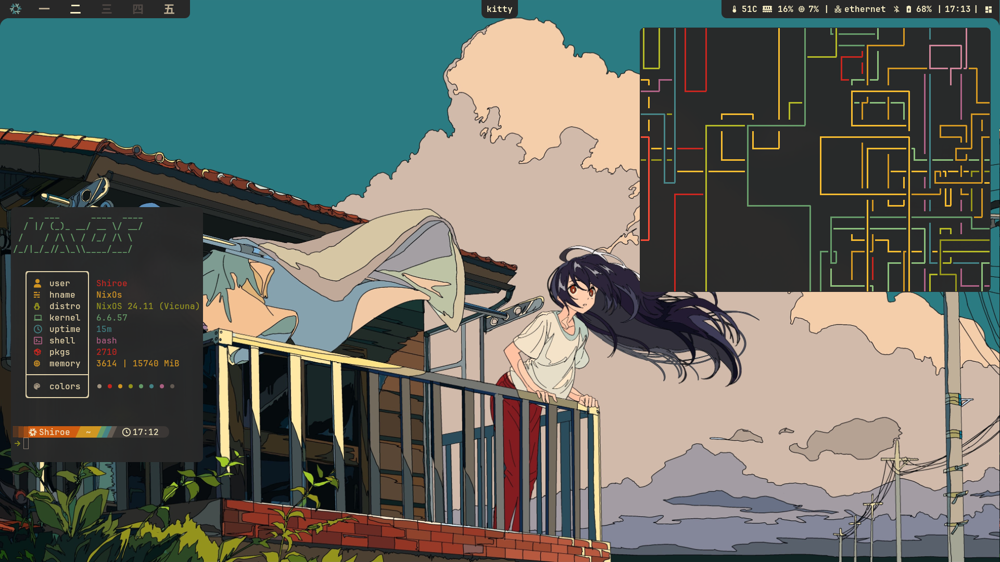
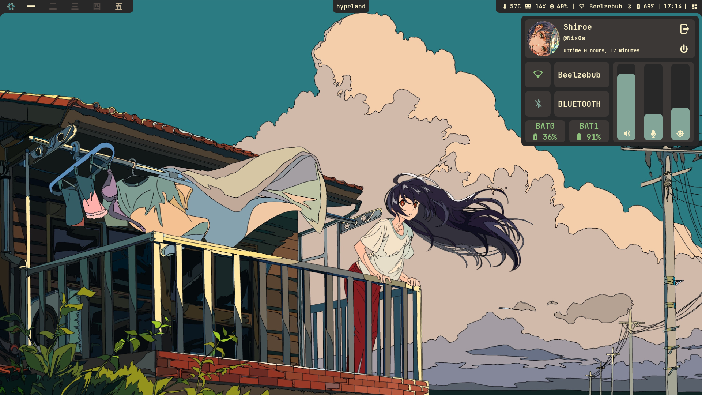
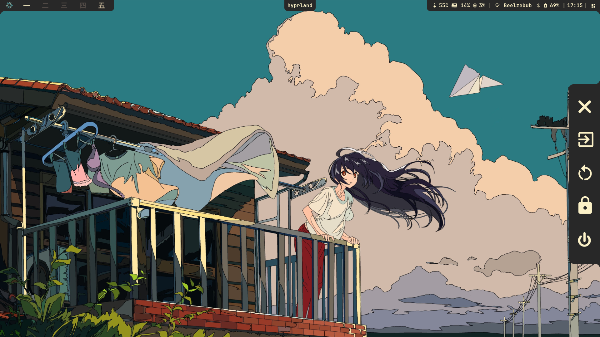
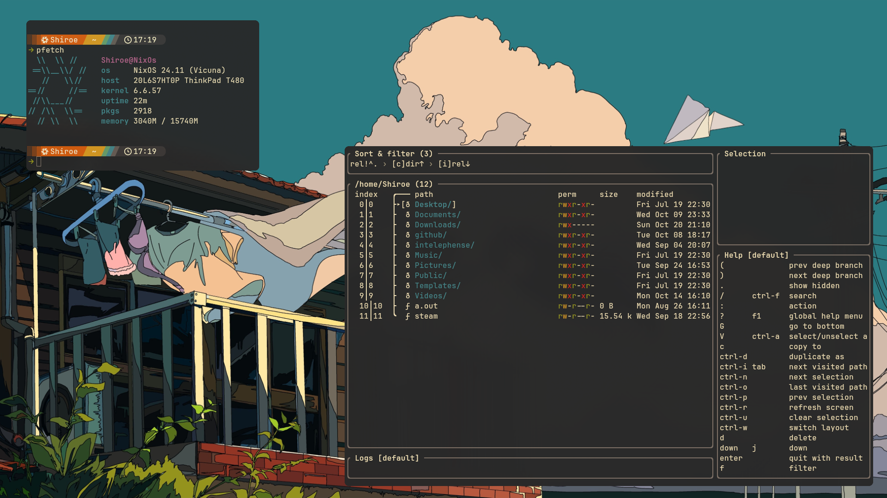
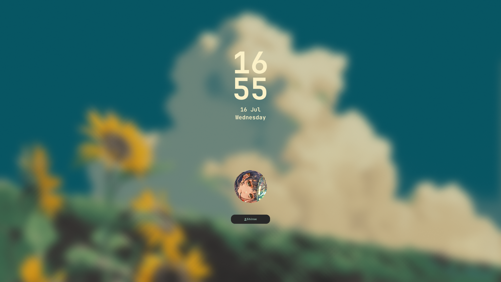

<h1 align="center">
    
   <br>
      1101101011's Flakes 
   <br>
       <br>

   <div align="center">
      <p></p>
      <div align="center">
         <a href="https://github.com/1101101011/nixdotfiles/stargazers">
            
         </a>
         <a href="https://github.com/1101101011/nixdotfiles/">
            
         </a>
         <a = href="https://nixos.org">
            
         </a>
         <a href="https://github.com/1101101011/nixdotfiles/blob/main/LICENSE">
            
         </a>
      </div>
      <br>
   </div>
</h1>

# Table of Contents

1. [Overview](#overview)
2. [Systems](#systems)
3. [Desktop Environment](#Desktop-Environment)
4. [Installation](#installation)
5. [Roadmap](#roadmap)
6. [Contributing](#contributing)
7. [License](#license)


## Overview

This repository contains my personal NixOS configuration files, which are used to set up my development environment. It includes configurations for various applications, services, and system settings tailored to my workflow.

## Systems
> [!NOTE]
> The only system that is currently available is `Kurohikari`.
> The other systems are work in progress and will be available soon.

List of Systems Configured in this flakes:
| System 	   | Architecture                   	| Description                               	|
|-----------   |--------------------------------	|-------------------------------------------	|
| 💻 Kurohikari| `x86_64-linux`                 	| ThinkPad T480 laptop, for development.    	|
| 🖥️ Kuroha    | `x86_64-linux`                 	| Main PC, mix of Gaming and Development.   	|
| 💾 Kagami    | `x86_64-linux`                 	| Virtual Machine, for Project Deployment.      |

## Desktop Environment

I use the [Hyprland](https://hyprland.org/) desktop environment, which is a dynamic tiling Wayland compositor. It provides a modern and efficient user interface with support for advanced features like animations, effects, and custom layouts.

### Gallery
> [!NOTE]
> This section showcases some screenshots of my Hyprland setup.
> The configuration for this setup is not yet available in this repository, but it will be added in the future.
<p align="center">
    <br>
    <br>
    <br>
    <br>
    <br>
</p>

## Installation
> [!NOTE]
> You can configure the packages and services you want to use in the`modules` directory to suit your needs.

> [!IMPORTANT]
> This configuration is designed to be used with NixOS and requires a basic understanding of Nix and NixOS concepts. 
> It is recommended to read the [NixOS manual](https://nixos.org/manual/nixos/stable/) before proceeding.

Step 1: Install dependencies before proceeding with the installation.
```bash
    nix-shell -p git gum
``` 

Step 1: Clone the repository

HTTPS
```bash
    git clone https://github.com/1101101011/nixdotfiles.git
```
SSH
```bash
    git clone git@github.com:1101101011/nixdotfiles.git
```

Step 2: Enter the cloned directory
```bash
    cd nixdotfiles
```

> [!NOTE]
> If you still haven't generated your system configuration do step 3, if you already have a system configuration, proceed to step 4.

Step 3: 
```bash
    nixos-generate-config
```

Step 4: Run the Installation Script
```bash
    ./install.sh
```

## Roadmap
- [X] Merge the `home-manager` standalone module into the `nixos` module.
- [X] Create an installation script to automate the `nixos` setup process.
- [ ] Update the nvim configuration to use the latest plugins and features.
- [ ] Integrate hyprland configuration into the `nixos` module.
- [ ] Switch from using EWW into Quickshell for more advanced widgets.
- [ ] Make a dyanamic theme switcher for Hyprland and other applications.
- [ ] Make the `nixos` configuration more modular, dynamic and reusable based on the host.
- [ ] Add more documentation and examples for users to understand the configuration.

## Contributing

Contributions are welcome! If you have any suggestions or improvements, feel free to open an issue or submit a pull request. Please ensure that your contributions align with the project's goals and follow the coding standards.

## License

This project is licensed under the MIT License. See the [LICENSE](./LICENSE) file for details.
